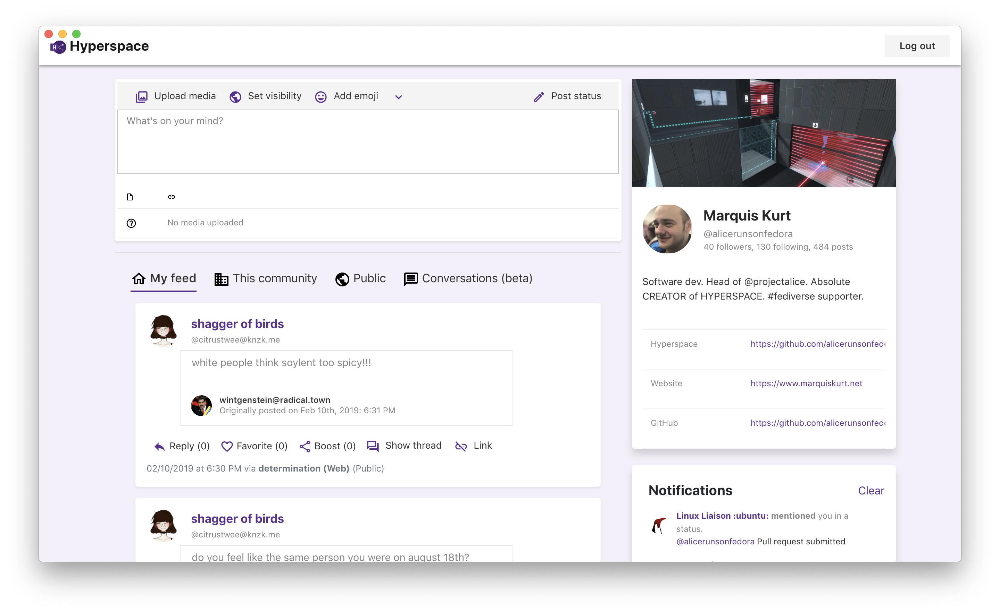

---




Hyperspace is a client for Mastodon and the fediverse written in React and TypeScript. It aims to provide a clean, simple, and fun interface for interacting with Mastodon instances. Currently, Hyperspace works on the web as a static site, desktop via Electron, and on mobile devices as a progressive web app*.

> Note: *Progressive web app support is currently experimental. Not all features may render or work correctly. PWA support may not work on Android.

## Building from source

To get the packages and environment set up, run `npm install`. Most commands and scripts derive from `create-react-app` and should be easy enough to use.

```bash
npm install
npm run build
```

### Building desktop versions

If you wish to build the desktop versions of Hyperspace, it is recommended to run `build-electron` instead of `npm run build`. This will build for Windows, macOS, and Linux.

Alternatively, you can run any of these commands to build for your specific platform:

- `build-electron-darwin` - build only for macOS
- `build-electron-win` - build only for Windows
- `build-electron-linux` - build only for Linux distributions (rpm,deb,AppImage)
- `build-electron-linux -- <package type>` - where `<package type>` is `rpm`,`deb`, or `appimage` to build the specific package type

> Note: Ensure you have code-signing certificates ready. `electron-builder` should automatically detect them and code-sign your apps for you.
>
> In addition, if you plan on creating versions for the Mac App Store, ensure that you have a provisioning profile and entitlements/info property list in the `electron` folder.

## Deploying to the Web

To run Hyperspace from a website, download either the static files or build from source and then upload them to your hosting server.

## Modules used

Hyperspace makes use of the following modules and components to make it as fluffy as possible:

- `megalodon` - the handler for Mastodon API calls
- `office-ui-fabric-react` - React components from Microsoft that offer Modern/Fluent design
- `@uifabric/icons` - Icon pack that goes with Fabric UI
- `moment` - for date formatting
- `node-sass` - for compiling the Sass files needed
- `electron` - for making the desktop versions
- `emoji-picker-react` - for adding an emoji picker

## Licensing

The Hyperspace project itself is licensed under the GNU Lesser General Public License, though some components are licensed under other free-software licenses such as the MIT License and GNU GPL.

## Contribute

Currently, there aren't any said rules for Hyperspace just yet on committing and submitting pull requests.

If you want to aid the project in other ways, consider supporting the project on [Patreon](https://patreon.com/marquiskurt).

If you have Matrix, you can join the Hyperspace community ([+hyperspace-masto:matrix.org](https://matrix.to/#/+hyperspace-masto:matrix.org)).